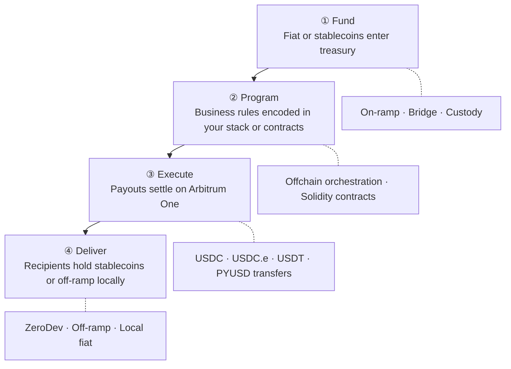
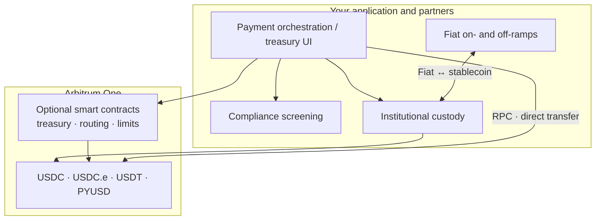
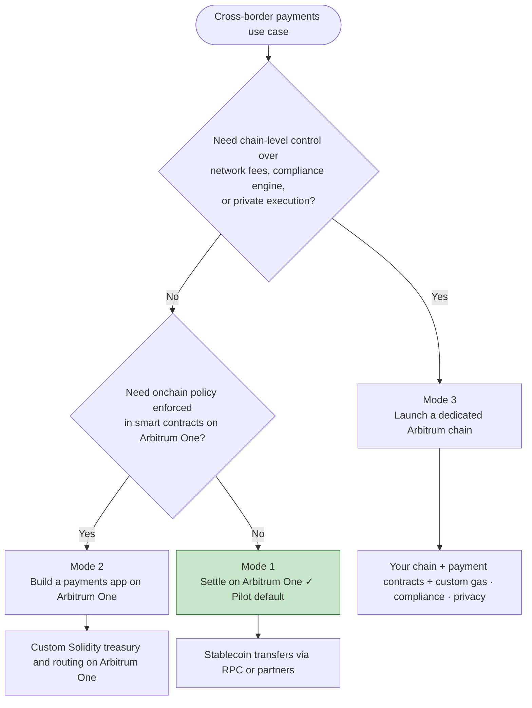
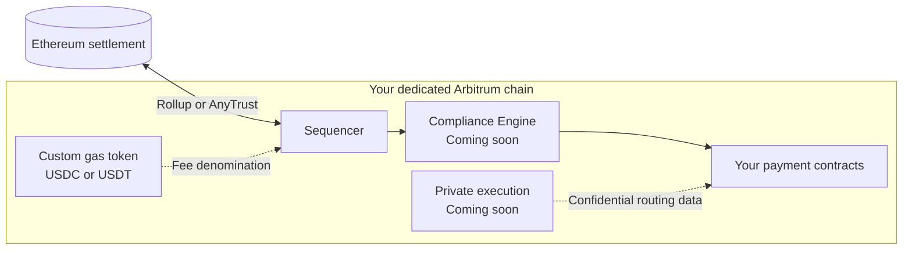

Cross-border payments on Arbitrum replace multi-hop intermediary banking with a single settlement layer: fund in fiat or stablecoins, execute programmable payouts in seconds, and reconcile with a clear onchain audit trail. Arbitrum One offers deep dollar stablecoin liquidity (USDC, USDC.e, USDT, PYUSD, and more), euro options such as EUROe, sub-cent transaction costs, and 24/7 settlement, without pre-funding nostro accounts across weekends and holidays.

Core use cases include, but are not limited to, global payouts, remittance, or programmable treasury.

:::info[Start with Arbitrum One]
For most pilots, **settle on Arbitrum One** before considering a dedicated chain. You get immediate access to billions in stablecoin liquidity and production infrastructure without operating your own network.
:::

## How cross-border payments work on Arbitrum

The repeatable pattern, used at scale by platforms like [Rise](https://blog.arbitrum.io/rise-global-payments/), has four stages. Your team can implement each stage with existing partners, custom smart contracts, or a combination of both.



<table>
  <thead>
    <tr>
      <th style={{ whiteSpace: 'nowrap', verticalAlign: 'top' }}>Stage</th>
      <th>What happens</th>
      <th>Where to learn more</th>
    </tr>
  </thead>
  <tbody>
    <tr>
      <td style={{ whiteSpace: 'nowrap', verticalAlign: 'top' }}><strong>Fund</strong></td>
      <td>Treasury receives fiat or stablecoins; optional on-ramp or bridge</td>
      <td><a href="/arbitrum-bridge/usdc-arbitrum-one">USDC on Arbitrum One</a>, <a href="/build-decentralized-apps/bridging/overview">Bridging overview</a></td>
    </tr>
    <tr>
      <td style={{ whiteSpace: 'nowrap', verticalAlign: 'top' }}><strong>Program</strong></td>
      <td>Business rules (who, how much, when, limits) encoded in your stack or smart contracts</td>
      <td><a href="/build-decentralized-apps/quickstart-solidity-remix">Build apps with Solidity quickstart</a> (Mode 2)</td>
    </tr>
    <tr>
      <td style={{ whiteSpace: 'nowrap', verticalAlign: 'top' }}><strong>Execute</strong></td>
      <td>Payouts settle on Arbitrum One in seconds</td>
      <td><a href="/for-devs/third-party-docs/Circle/usdc-quickstart-guide">USDC quick start guide</a>, <a href="/how-arbitrum-works/deep-dives/transaction-lifecycle">Transaction lifecycle</a></td>
    </tr>
    <tr>
      <td style={{ whiteSpace: 'nowrap', verticalAlign: 'top' }}><strong>Deliver</strong></td>
      <td>Recipients hold stablecoins (for example USDC, USDT, PYUSD, or EUROe) or off-ramp to local currency</td>
      <td><a href="#integrated-ecosystem">Integrated ecosystem</a> below</td>
    </tr>
  </tbody>
</table>

### Reference architecture

The diagram below shows how payment components typically connect. Not every integration is required for a pilot, most teams start with funding, settlement on Arbitrum One, and one off-ramp partner.



## Choose your deployment mode

Most teams start in **Mode 1** and add Mode 2 or Mode 3 only when requirements demand it. The modes are **not mutually exclusive in capability**: Mode 3 (a dedicated Arbitrum chain) is a **superset** — you can still deploy your own payment contracts on your chain, similar to Mode 2, while also controlling network fees, compliance, and data visibility.



### Mode 1: Settle on Arbitrum One (recommended for pilots)

Use Arbitrum One as your **settlement rail**. Your application, or a partner orchestration layer, submits stablecoin transfers (for example USDC, USDC.e, USDT, or PYUSD) over standard RPC. No custom smart contracts are required on day one.

**Choose this when:**

- You want the fastest path to production
- Your compliance and UX logic lives offchain or in partner systems
- You need access to existing stablecoin liquidity and off-ramps

:::tip[Wallet UX for pilots — ZeroDev]
If payers or payees touch funds onchain, start with **[ZeroDev](https://docs.zerodev.app/)** smart accounts (built by Offchain Labs). ZeroDev solves the cold-start problem: passkey or social login, sponsored gas (or gas paid in your settlement ERC-20), and batched transfers on Arbitrum One — without building wallet infrastructure from scratch. It works with whichever stablecoin you settle in, not USDC alone. See [ZeroDev on Arbitrum](/for-devs/third-party-docs/ZeroDev/zero-dev).
:::

**Core documentation:**

- [USDC on Arbitrum One](/arbitrum-bridge/usdc-arbitrum-one): native USDC vs bridged USDC (USDC.e)
- [USDC quick start guide](/for-devs/third-party-docs/Circle/usdc-quickstart-guide): programmatic stablecoin transfers
- [ZeroDev on Arbitrum](/for-devs/third-party-docs/ZeroDev/zero-dev): embedded smart accounts and gasless UserOps
- [Chain info](/for-devs/dev-tools-and-resources/chain-info): chain IDs and network parameters
- [RPC endpoints and providers](/build-decentralized-apps/reference/node-providers)
- [Gas and fees](/how-arbitrum-works/deep-dives/gas-and-fees)
- [How to estimate gas](/build-decentralized-apps/how-to-estimate-gas)

### Mode 2: Build a payments application on Arbitrum One

Deploy **Solidity smart contracts** for treasury logic, routing, FX policy, or payout automation directly on Arbitrum One. Combine onchain execution with offchain compliance and fiat rails. If you later need chain-level control (custom gas, compliance engine, private execution), you can move to **Mode 3** and deploy the same style of contracts on your own chain.

**Choose this when:**

- Payout rules, limits, or multi-party approvals must be enforced onchain
- You want composability with DeFi liquidity and existing Arbitrum integrations
- You are building a proprietary orchestration layer (similar to Rise's programmable payroll)

**Core documentation:**

- [ZeroDev on Arbitrum](/for-devs/third-party-docs/ZeroDev/zero-dev): recommended smart accounts for payers and payees (gasless flows, session keys, batching)
- [ZeroDev documentation](https://docs.zerodev.app/): SDKs, paymaster, and integration guides
- [Build apps with Solidity quickstart](/build-decentralized-apps/quickstart-solidity-remix): deploy your first contract
- [Create a token using Foundry](/build-decentralized-apps/quickstart-create-a-token): ERC-20 patterns for stablecoin interaction
- [Cross-chain messaging](/build-decentralized-apps/bridging/cross-chain-messaging): coordinate logic across chains
- [Oracles overview](/build-decentralized-apps/oracles/overview-oracles): FX rates and external data
- [Circle Paymaster quickstart](/for-devs/third-party-docs/Circle/usdc-paymaster-quickstart): let users pay gas in USDC
- [LayerZero](/for-devs/third-party-docs/LayerZero): omnichain messaging and tokens
- [Allium on Arbitrum](https://docs.allium.so/historical-data/supported-blockchains/evm/arbitrum): query transfers and balances for reconciliation
- [Arbitrum SDK](https://github.com/OffchainLabs/arbitrum-sdk): bridging and messaging utilities

:::caution[Sample payment contracts]
Arbitrum docs do not yet include reference contracts for treasury, batch payout, or remittance flows. For v1 pilots, use the [USDC quick start guide](/for-devs/third-party-docs/Circle/usdc-quickstart-guide) to validate settlement, then work with your engineering team or [contact Offchain Labs Enterprise Services](https://www.offchain.io/contact) to design contract architecture.
:::

### Mode 3: Launch a dedicated Arbitrum chain

Deploy your **own Arbitrum chain** when you need control over network economics, fee denomination, permissions, and data visibility. This path fits institutions scaling proprietary payment infrastructure. You can deploy **your own payment smart contracts** on the chain (the same programmability as Mode 2) while adding chain-level controls that Arbitrum One alone cannot offer.

**Choose this when:**

- You require stablecoin-denominated network fees (USDC or USDT as gas)
- You need protocol-level compliance controls or restricted participation
- Proprietary routing, FX, or counterparty data must not appear on a public ledger



**Core documentation:**

- [Overview of Arbitrum chains](/launch-arbitrum-chain/a-gentle-introduction)
- [Deploy a production chain: overview](/launch-arbitrum-chain/arbitrum-chain-sdk-introduction)
- [Why choose a custom gas token](/launch-arbitrum-chain/features/common/gas-and-fees/choose-custom-gas-token)
- [Configure a custom gas token (AnyTrust)](/launch-arbitrum-chain/configure-your-chain/common/gas/use-a-custom-gas-token-anytrust)
- [Configure a custom gas token (Rollup)](/launch-arbitrum-chain/configure-your-chain/common/gas/use-a-custom-gas-token-rollup)
- [Native mint/burn gas token](/launch-arbitrum-chain/configure-your-chain/common/gas/configure-native-mint-burn-gas-token)
- [Implement Circle bridged USDC](/launch-arbitrum-chain/third-party-integrations/bridged-usdc-standard)
- [Ownership structure and access control](/launch-arbitrum-chain/maintain-your-chain/ownership-structure-access-control)
- [Third-party infrastructure providers](/launch-arbitrum-chain/third-party-integrations/third-party-providers)

**Coming soon on Arbitrum chains:**

| Capability | Status | Description |
| --- | --- | --- |
| **Compliance Engine** | Coming soon | Bring-your-own-provider KYC/AML screening with protocol-level transaction filtering on your dedicated chain |
| **Private Chains** | Coming soon | Confidential execution for proprietary routing, FX margins, and counterparty data |

Until these advanced features ship, [contact Offchain Labs Enterprise Services](https://www.offchain.io/contact) to become a designer partner!

## Choose stablecoins by corridor

Map settlement assets to **destination market**, **liquidity**, and **issuer/regulatory** requirements. Arbitrum One supports multiple USD- and euro-denominated tokens today; verify addresses on [Arbiscan](https://arbiscan.io/) before production.

### USD-denominated (Arbitrum One)

| Token | Notes |
| --- | --- |
| **Native USDC** | Circle-issued on Arbitrum One; default for most pilots, CEX support, and direct redemption |
| **Bridged USDC (USDC.e)** | Ethereum-native USDC via Arbitrum's canonical bridge; legacy liquidity — prefer native USDC for new flows |
| **USDT** | Strong adoption in LATAM, Africa, and parts of APAC |
| **PYUSD** | PayPal USD on Arbitrum One ([Paxos](https://docs.paxos.com/guides/developer/blockchains)); PayPal ecosystem payouts |
| **USDL** | Yield-bearing USD stablecoin on Arbitrum One ([Paxos International](https://www.paxos.com/newsroom/yield-bearing-stablecoin-lift-dollar-usdl-launches-on-arbitrum)); treasury yield use cases |

### Euro and other non-USD (Arbitrum One)

| Token | Notes |
| --- | --- |
| **EUROe** | Euro stablecoin native on Arbitrum One ([Membrane Finance](https://dev.euroe.com/docs/Stablecoin/contract-addresses), [Arbiscan](https://arbiscan.io/token/0xcf985aba4647a432e60efceeb8054bbd64244305)); EU-regulated, suited to SEPA-corridor payouts |
| **EURS** | STASIS euro stablecoin on Arbitrum One ([Arbiscan](https://arbiscan.io/token/0xd22a58f79e9481d1a88e00c343885a588b34b68b)); established DeFi liquidity (for example Aave v3) |
| **EURC** | Circle euro stablecoin; **not natively issued on Arbitrum** per [Circle supported chains](https://developers.circle.com/circle-mint/references/supported-chains-and-currencies) — any EURC on Arbitrum is bridged; confirm issuer and redemption path before use |

:::info[Corridor selection]
For dollar corridors, start with **native USDC** unless a partner or market requires USDT or PYUSD. For euro corridors on Arbitrum One, **EUROe** and **EURS** are live today. Always confirm liquidity, off-ramp support, and compliance for your jurisdictions.
:::

See [USDC on Arbitrum One](/arbitrum-bridge/usdc-arbitrum-one) for USDC vs USDC.e addresses and bridging options.

## Integrated ecosystem

Partners below support production payment stacks on Arbitrum. Links point to Arbitrum docs where available; external links go to partner documentation.

:::info[Third-party services]
External links leave docs.arbitrum.io. Arbitrum documents integration patterns for listed partners but does not endorse specific vendors. Evaluate each provider for your regulatory and operational requirements.
:::

### Stablecoin issuers

| Partner | Description | Documentation |
| --- | --- | --- |
| Circle (USDC) | Native and bridged USDC on Arbitrum One | [USDC quick start](/for-devs/third-party-docs/Circle/usdc-quickstart-guide) · [USDC on Arbitrum One](/arbitrum-bridge/usdc-arbitrum-one) |
| Tether (USDT) | USDT liquidity on Arbitrum One | [Tether documentation](https://tether.to/en/developers) *(external)* |
| Paxos (PYUSD, USDL) | PYUSD and USDL on Arbitrum One | [Paxos blockchains](https://docs.paxos.com/guides/developer/blockchains) *(external)* |
| PayPal (PYUSD) | PayPal USD stablecoin | [PayPal Developer](https://developer.paypal.com/) *(external)* |
| Membrane Finance (EUROe) | Euro stablecoin native on Arbitrum One | [EUROe contract addresses](https://dev.euroe.com/docs/Stablecoin/contract-addresses) *(external)* |
| STASIS (EURS) | Euro stablecoin on Arbitrum One | [EURS on Arbiscan](https://arbiscan.io/token/0xd22a58f79e9481d1a88e00c343885a588b34b68b) *(external)* |

### Fiat on- and off-ramps

| Partner | Description | Documentation |
| --- | --- | --- |
| Yellow Card | Africa-focused fiat ↔ crypto | [Yellow Card](https://yellowcard.io/) *(external)* |
| MoonPay | Global fiat on-ramp | [MoonPay documentation](https://dev.moonpay.com/) *(external)* |
| Banxa | Regulated fiat gateway | [Banxa documentation](https://docs.banxa.com/) *(external)* |
| Transak | Fiat on- and off-ramp API | [Transak documentation](https://docs.transak.com/) *(external)* |

### Institutional custody

| Partner | Description | Documentation |
| --- | --- | --- |
| Fireblocks | Institutional wallet and treasury infrastructure | [Fireblocks documentation](https://developers.fireblocks.com/) *(external)* |
| BitGo | Qualified custody and wallet API | [BitGo documentation](https://developers.bitgo.com/) *(external)* |
| Coinbase Institutional | Custody and trading for institutions | [Coinbase Institutional](https://www.coinbase.com/institutional) *(external)* |

### Compliance and analytics

| Partner | Description | Documentation |
| --- | --- | --- |
| TRM Labs | Blockchain intelligence and AML | [TRM Labs](https://www.trmlabs.com/) *(external)* |
| Chainalysis | Compliance and investigation tools | [Chainalysis](https://www.chainalysis.com/) *(external)* |
| Elliptic | Crypto compliance and screening | [Elliptic](https://www.elliptic.co/) *(external)* |

### Oracles and market data

| Partner | Description | Documentation |
| --- | --- | --- |
| Chainlink | Price feeds and automation | [Chainlink on Arbitrum](/for-devs/oracles/chainlink/) |
| Pyth Network | Real-time financial market data | [Pyth documentation](https://docs.pyth.network/) *(external)* |

### Wallets and smart accounts (recommended)

| Partner | Description | Documentation |
| --- | --- | --- |
| **ZeroDev** | Offchain Labs smart account stack: gasless or ERC-20 gas, passkey/social login, batching, session keys for payouts on Arbitrum | [ZeroDev on Arbitrum](/for-devs/third-party-docs/ZeroDev/zero-dev) · [ZeroDev docs](https://docs.zerodev.app/) |

### Payment orchestration

| Partner | Description | Documentation |
| --- | --- | --- |
| Stripe (Bridge) | Fiat and stablecoin payment infrastructure | [Bridge documentation](https://apidocs.bridge.xyz/) *(external)* |
| LayerZero | Omnichain messaging and tokens | [LayerZero on Arbitrum](/for-devs/third-party-docs/LayerZero) |

### Data and reconciliation

| Partner | Description | Documentation |
| --- | --- | --- |
| Allium | Arbitrum transfers, balances, and SQL/API analytics for treasury reconciliation | [Allium on Arbitrum](https://docs.allium.so/historical-data/supported-blockchains/evm/arbitrum) *(external)* |

Explore more projects on the [Arbitrum Portal](https://portal.arbitrum.io/).

## Recommended pilot checklist

A minimal path from zero to a verified settlement on Arbitrum One. Skip steps that do not apply to your mode (see the [decision tree](#choose-your-deployment-mode)).

1. **Pick a deployment mode.** Most pilots start with **Mode 1** (settle on Arbitrum One). Use Mode 2 if you need onchain treasury contracts; Mode 3 only if you need your own chain.

2. **Pick a stablecoin for your corridor.** Dollar pilots: [native USDC on Arbitrum One](/arbitrum-bridge/usdc-arbitrum-one). See [Choose stablecoins by corridor](#choose-stablecoins-by-corridor) for USDT, PYUSD, or euro options.

3. **Connect and send a test transfer on Sepolia.** Get an RPC URL from [Chain info](/for-devs/dev-tools-and-resources/chain-info) (chain ID `421614`). Fund a test wallet with Sepolia ETH (gas) and Sepolia USDC ([Circle faucet](https://faucet.circle.com/)). Send `1` USDC to a wallet you control:

```typescript
// npm i viem — run with PRIVATE_KEY set (never commit keys)
import { createWalletClient, http, parseUnits } from 'viem';
import { privateKeyToAccount } from 'viem/accounts';
import { arbitrumSepolia } from 'viem/chains';

const USDC = '0x75faf114eafb1BDbe2F0316DF893fd58CE46AA4d';
const account = privateKeyToAccount(process.env.PRIVATE_KEY as `0x${string}`);
const walletClient = createWalletClient({
  account,
  chain: arbitrumSepolia,
  transport: http('https://sepolia-rollup.arbitrum.io/rpc'),
});

await walletClient.writeContract({
  address: USDC,
  abi: [{ name: 'transfer', type: 'function', stateMutability: 'nonpayable', inputs: [{ name: 'to', type: 'address' }, { name: 'amount', type: 'uint256' }], outputs: [{ type: 'bool' }] }] as const,
  functionName: 'transfer',
  args: ['0xYourRecipientAddress' as `0x${string}`, parseUnits('1', 6)],
});
```

Confirm the transaction on [Arbitrum Sepolia Arbiscan](https://sepolia.arbiscan.io/). For a full app tutorial, use the [USDC quick start guide](/for-devs/third-party-docs/Circle/usdc-quickstart-guide).

4. **Add ZeroDev if end users touch funds onchain.** Integrate [ZeroDev on Arbitrum](/for-devs/third-party-docs/ZeroDev/zero-dev) for passkey login and gasless payouts (Mode 1 and Mode 2). Skip this step if only your treasury wallet sends transfers.

5. **Wire production partners before mainnet volume.** Choose on-ramps, custody, and compliance screening from the [integrated ecosystem](#integrated-ecosystem). Track payouts with [Allium on Arbitrum](https://docs.allium.so/historical-data/supported-blockchains/evm/arbitrum) when you need reconciliation at scale.

## Get help

- **Technical documentation:** continue with [Build apps with Solidity](/build-decentralized-apps/quickstart-solidity-remix) or [Launch an Arbitrum chain](/launch-arbitrum-chain/a-gentle-introduction).
- **Hands-on guidance:** [Offchain Labs Enterprise Services](https://www.offchain.io/contact) for solution design, pilot scoping, and payment infrastructure support (Arbitrum, ZeroDev, and dedicated chains).
