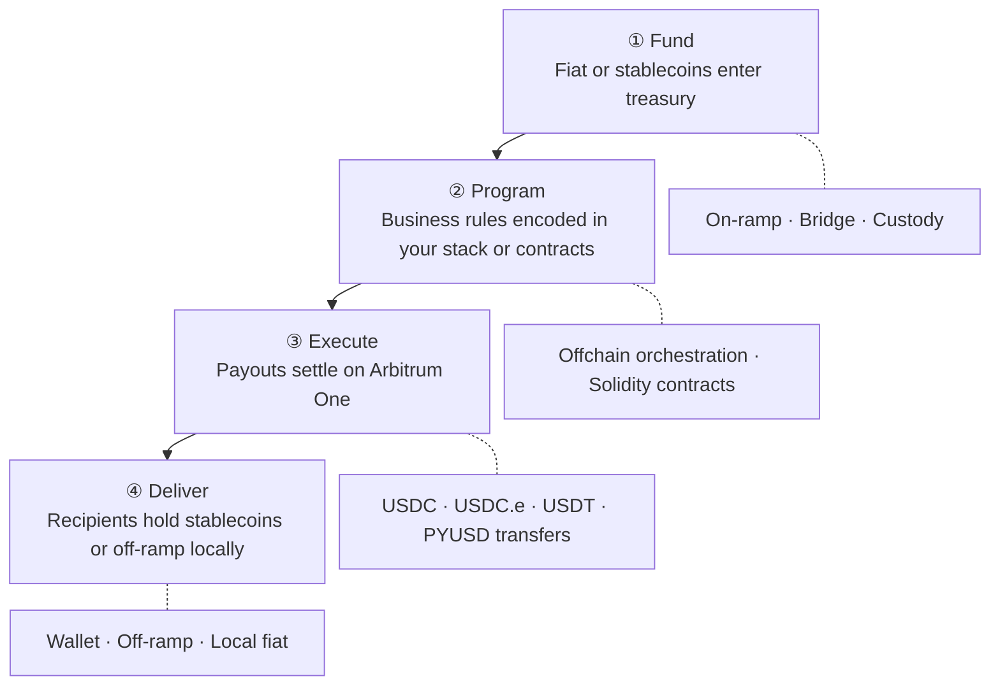
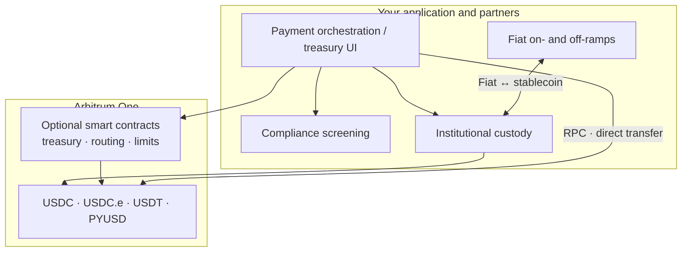
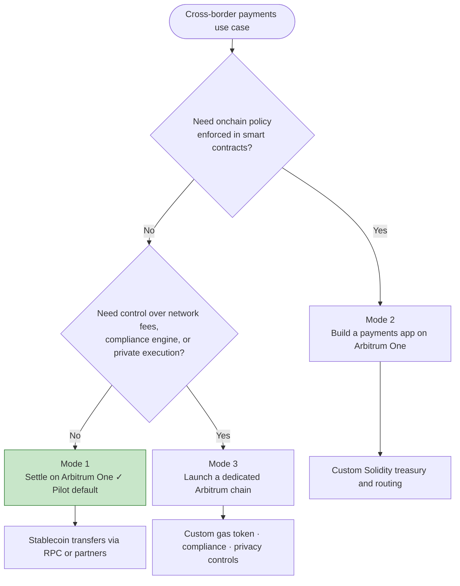
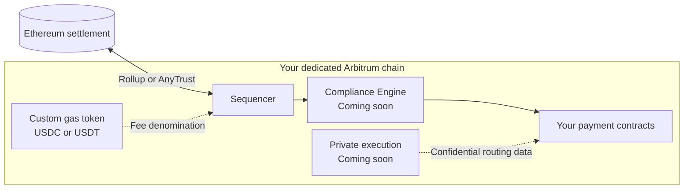

Cross-border payments on Arbitrum replace multi-hop intermediary banking with a single settlement layer: fund in fiat or stablecoins, execute programmable payouts in seconds, and reconcile with a clear onchain audit trail. Arbitrum One offers deep USDC, USDT, and PYUSD liquidity, sub-cent transaction costs, and 24/7 settlement, without pre-funding nostro accounts across weekends and holidays.

Core use cases include, but are not limited to, global payouts, remittance, or programmable treasury.

:::info[Start with Arbitrum One]
For most pilots, **settle on Arbitrum One** before considering a dedicated chain. You get immediate access to billions in stablecoin liquidity and production infrastructure without operating your own network.
:::

## How cross-border payments work on Arbitrum

The repeatable pattern, used at scale by platforms like [Rise](https://blog.arbitrum.io/rise-global-payments/), has four stages. Your team can implement each stage with existing partners, custom smart contracts, or a combination of both.

| Stage | What happens | Where to learn more |
| --- | --- | --- |
| **Fund** | Treasury receives fiat or stablecoins; optional on-ramp or bridge | [USDC on Arbitrum One](/arbitrum-bridge/usdc-arbitrum-one), [Bridging overview](/build-decentralized-apps/bridging/overview) |
| **Program** | Business rules (who, how much, when, limits) encoded in your stack or smart contracts | [Build apps with Solidity quickstart](/build-decentralized-apps/quickstart-solidity-remix) (Mode 2) |
| **Execute** | Payouts settle on Arbitrum One in seconds | [USDC quick start guide](/for-devs/third-party-docs/Circle/usdc-quickstart-guide), [Transaction lifecycle](/how-arbitrum-works/deep-dives/transaction-lifecycle) |
| **Deliver** | Recipients hold USDC, USDT, or PYUSD, or off-ramp to local currency | [Integrated ecosystem](#integrated-ecosystem) below |

### Reference architecture

The diagram below shows how payment components typically connect. Not every integration is required for a pilot, most teams start with funding, settlement on Arbitrum One, and one off-ramp partner.

## Choose your deployment mode

Most teams start in **Mode 1** and move to Mode 2 or 3 only when product or regulatory requirements demand it.

### Mode 1: Settle on Arbitrum One (recommended for pilots)

Use Arbitrum One as your **settlement rail**. Your application, or a partner orchestration layer, submits USDC, USDT, or PYUSD transfers over standard RPC. No custom smart contracts are required on day one.

**Choose this when:**

- You want the fastest path to production
- Your compliance and UX logic lives offchain or in partner systems
- You need access to existing stablecoin liquidity and off-ramps

**Core documentation:**

- [USDC on Arbitrum One](/arbitrum-bridge/usdc-arbitrum-one): native USDC vs bridged USDC (USDC.e)
- [USDC quick start guide](/for-devs/third-party-docs/Circle/usdc-quickstart-guide): programmatic stablecoin transfers
- [Chain info](/for-devs/dev-tools-and-resources/chain-info): chain IDs and network parameters
- [RPC endpoints and providers](/build-decentralized-apps/reference/node-providers)
- [Gas and fees](/how-arbitrum-works/deep-dives/gas-and-fees)
- [How to estimate gas](/build-decentralized-apps/how-to-estimate-gas)

### Mode 2: Build a payments application on Arbitrum One

Deploy **Solidity smart contracts** for treasury logic, routing, FX policy, or payout automation directly on Arbitrum One. Combine onchain execution with offchain compliance and fiat rails.

**Choose this when:**

- Payout rules, limits, or multi-party approvals must be enforced onchain
- You want composability with DeFi liquidity and existing Arbitrum integrations
- You are building a proprietary orchestration layer (similar to Rise's programmable payroll)

**Core documentation:**

- [Build apps with Solidity quickstart](/build-decentralized-apps/quickstart-solidity-remix): deploy your first contract
- [Create a token using Foundry](/build-decentralized-apps/quickstart-create-a-token): ERC-20 patterns for stablecoin interaction
- [Cross-chain messaging](/build-decentralized-apps/bridging/cross-chain-messaging): coordinate logic across chains
- [Oracles overview](/build-decentralized-apps/oracles/overview-oracles): FX rates and external data
- [Circle Paymaster quickstart](/for-devs/third-party-docs/Circle/usdc-paymaster-quickstart): let users pay gas in USDC
- [Openfort](/for-devs/third-party-docs/Openfort): embedded wallets and sponsored transactions
- [ZeroDev smart accounts](/for-devs/third-party-docs/ZeroDev/zero-dev): account abstraction on Arbitrum
- [LayerZero](/for-devs/third-party-docs/LayerZero): omnichain messaging and tokens
- [The Graph](/for-devs/third-party-docs/TheGraph): index payout events for reconciliation
- [Arbitrum SDK](https://github.com/OffchainLabs/arbitrum-sdk): bridging and messaging utilities

:::caution[Sample payment contracts]
Arbitrum docs do not yet include reference contracts for treasury, batch payout, or remittance flows. For v1 pilots, use the [USDC quick start guide](/for-devs/third-party-docs/Circle/usdc-quickstart-guide) to validate settlement, then work with your engineering team or [contact the Arbitrum team](https://arbitrum.io/contact) to design contract architecture.
:::

### Mode 3: Launch a dedicated Arbitrum chain

Deploy your **own Arbitrum chain** when you need control over network economics, fee denomination, permissions, and data visibility. This path fits institutions scaling proprietary payment infrastructure.

**Choose this when:**

- You require stablecoin-denominated network fees (USDC or USDT as gas)
- You need protocol-level compliance controls or restricted participation
- Proprietary routing, FX, or counterparty data must not appear on a public ledger

**Core documentation:**

- [Overview of Arbitrum chains](/launch-arbitrum-chain/a-gentle-introduction)
- [Deploy a production chain: overview](/launch-arbitrum-chain/arbitrum-chain-sdk-introduction)
- [Why choose a custom gas token](/launch-arbitrum-chain/features/common/gas-and-fees/choose-custom-gas-token)
- [Configure a custom gas token (AnyTrust)](/launch-arbitrum-chain/configure-your-chain/common/gas/use-a-custom-gas-token-anytrust)
- [Configure a custom gas token (Rollup)](/launch-arbitrum-chain/configure-your-chain/common/gas/use-a-custom-gas-token-rollup)
- [Native mint/burn gas token](/launch-arbitrum-chain/configure-your-chain/common/gas/configure-native-mint-burn-gas-token)
- [Implement Circle bridged USDC](/launch-arbitrum-chain/third-party-integrations/bridged-usdc-standard)
- [Ownership structure and access control](/launch-arbitrum-chain/maintain-your-chain/ownership-structure-access-control)
- [Third-party infrastructure providers](/launch-arbitrum-chain/third-party-integrations/third-party-providers)

**Coming soon on Arbitrum chains:**

| Capability | Status | Description |
| --- | --- | --- |
| **Compliance Engine** | Coming soon | Bring-your-own-provider KYC/AML screening with protocol-level transaction filtering on your dedicated chain |
| **Private Chains** | Coming soon | Confidential execution for proprietary routing, FX margins, and counterparty data |

Until these advanced features ship, [contact the Arbitrum team](https://arbitrum.io/contact) to become a designer partner!

## Stablecoins on Arbitrum One

Cross-border payment flows on Arbitrum One typically settle in **USDC**, **USDC.e** (bridged USDC), **USDT**, or **PYUSD**.

| Token | Notes |
| --- | --- |
| **Native USDC** | Circle-issued USDC on Arbitrum One; preferred for CEX support and direct redemption |
| **Bridged USDC (USDC.e)** | Ethereum-native USDC bridged via Arbitrum's canonical bridge |
| **USDT** | Widely used in LATAM, Africa, and parts of APAC corridors |
| **PYUSD** | PayPal USD stablecoin; useful for PayPal ecosystem and consumer payout flows |

See [USDC on Arbitrum One](/arbitrum-bridge/usdc-arbitrum-one) for token addresses, differences, and bridging options.

## Integrated ecosystem

Partners below support production payment stacks on Arbitrum. Links point to Arbitrum docs where available; external links go to partner documentation.

:::info[Third-party services]
External links leave docs.arbitrum.io. Arbitrum documents integration patterns for listed partners but does not endorse specific vendors. Evaluate each provider for your regulatory and operational requirements.
:::

### Stablecoin issuers

| Partner | Description | Documentation |
| --- | --- | --- |
| Circle (USDC) | Native and bridged USDC on Arbitrum One | [USDC quick start](/for-devs/third-party-docs/Circle/usdc-quickstart-guide) · [USDC on Arbitrum One](/arbitrum-bridge/usdc-arbitrum-one) |
| Tether (USDT) | USDT liquidity on Arbitrum One | [Tether documentation](https://tether.to/en/developers) *(external)* |
| Paxos (USDG) | Regulated stablecoin issuer | [Paxos documentation](https://docs.paxos.com/) *(external)* |
| PayPal (PYUSD) | PayPal USD stablecoin | [PayPal Developer](https://developer.paypal.com/) *(external)* |

### Fiat on- and off-ramps

| Partner | Description | Documentation |
| --- | --- | --- |
| Yellow Card | Africa-focused fiat ↔ crypto | [Yellow Card](https://yellowcard.io/) *(external)* |
| MoonPay | Global fiat on-ramp | [MoonPay documentation](https://dev.moonpay.com/) *(external)* |
| Banxa | Regulated fiat gateway | [Banxa documentation](https://docs.banxa.com/) *(external)* |
| Transak | Fiat on- and off-ramp API | [Transak documentation](https://docs.transak.com/) *(external)* |

### Institutional custody

| Partner | Description | Documentation |
| --- | --- | --- |
| Fireblocks | Institutional wallet and treasury infrastructure | [Fireblocks documentation](https://developers.fireblocks.com/) *(external)* |
| BitGo | Qualified custody and wallet API | [BitGo documentation](https://developers.bitgo.com/) *(external)* |
| Coinbase Institutional | Custody and trading for institutions | [Coinbase Institutional](https://www.coinbase.com/institutional) *(external)* |

### Compliance and analytics

| Partner | Description | Documentation |
| --- | --- | --- |
| TRM Labs | Blockchain intelligence and AML | [TRM Labs](https://www.trmlabs.com/) *(external)* |
| Chainalysis | Compliance and investigation tools | [Chainalysis](https://www.chainalysis.com/) *(external)* |
| Elliptic | Crypto compliance and screening | [Elliptic](https://www.elliptic.co/) *(external)* |
| Webacy | Onchain risk data | [Webacy Risk Data Network](/for-devs/third-party-docs/Webacy) |

### Oracles and market data

| Partner | Description | Documentation |
| --- | --- | --- |
| Chainlink | Price feeds and automation | [Chainlink on Arbitrum](/for-devs/oracles/chainlink/) |
| Pyth Network | Real-time financial market data | [Pyth documentation](https://docs.pyth.network/) *(external)* |

### Payment orchestration and wallets

| Partner | Description | Documentation |
| --- | --- | --- |
| Stripe (Bridge) | Fiat and stablecoin payment infrastructure | [Bridge documentation](https://apidocs.bridge.xyz/) *(external)* |
| Venly | Wallets, assets, and fiat payments | [Venly on Arbitrum](/for-devs/third-party-docs/Venly) |
| Openfort | Embedded wallets and sponsored transactions | [Openfort on Arbitrum](/for-devs/third-party-docs/Openfort) |
| ZeroDev | Smart accounts and account abstraction | [ZeroDev on Arbitrum](/for-devs/third-party-docs/ZeroDev/zero-dev) |
| MetaMask Smart Accounts | Smart account tooling | [MetaMask on Arbitrum](/for-devs/third-party-docs/MetaMask) |
| LayerZero | Omnichain messaging and tokens | [LayerZero on Arbitrum](/for-devs/third-party-docs/LayerZero) |

Explore more projects on the [Arbitrum Portal](https://portal.arbitrum.io/).

## Recommended pilot checklist

1. **Confirm your deployment mode:** default to Mode 1 (settle on Arbitrum One) unless onchain policy or chain-level control is a day-one requirement.
2. **Choose stablecoins and corridors:** map USDC, USDT, and PYUSD preference by destination market; read [USDC on Arbitrum One](/arbitrum-bridge/usdc-arbitrum-one).
3. **Connect to Arbitrum One:** configure RPC and testnet or mainnet access via [Chain info](/for-devs/dev-tools-and-resources/chain-info).
4. **Execute a test settlement:** send a USDC transfer using the [USDC quick start guide](/for-devs/third-party-docs/Circle/usdc-quickstart-guide).
5. **Wire fiat and compliance partners:** select on-ramps, custody, and screening from the [integrated ecosystem](#integrated-ecosystem) above.
6. **Add programmability if needed:** deploy treasury contracts (Mode 2) or evaluate a dedicated chain (Mode 3).
7. **Plan reconciliation:** index onchain events with [The Graph](/for-devs/third-party-docs/TheGraph) or your existing data stack.

## Get help

- **Technical documentation:** continue with [Build apps with Solidity](/build-decentralized-apps/quickstart-solidity-remix) or [Launch an Arbitrum chain](/launch-arbitrum-chain/a-gentle-introduction).
- **Hands-on guidance:** [Contact the Arbitrum team](https://arbitrum.io/contact) for solution design, pilot scoping, or Enterprise Services.
