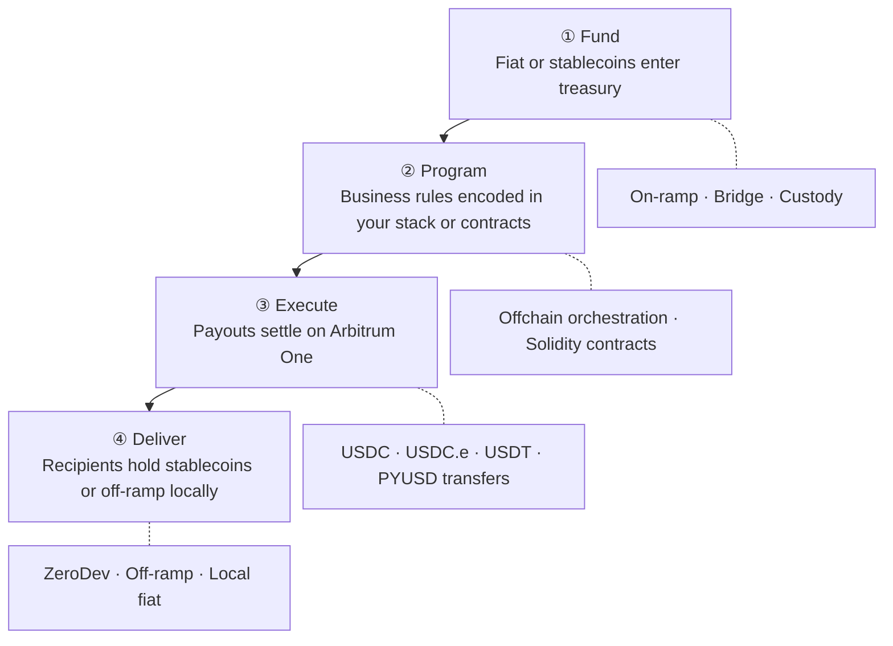
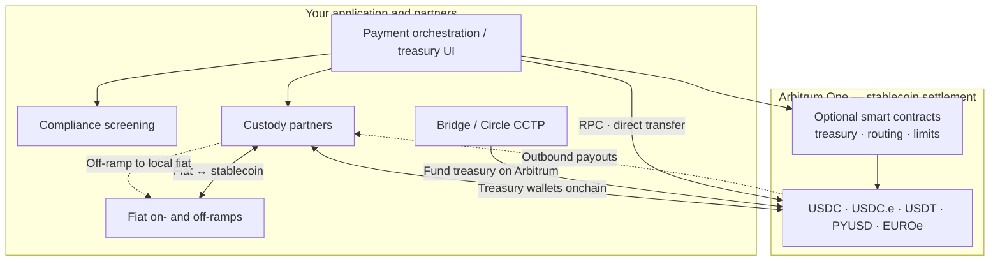
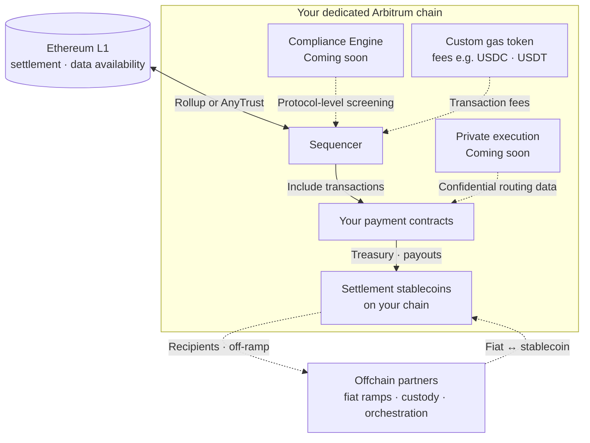

Cross-border payments on Arbitrum replace multi-hop intermediary banking with a single settlement flow. Fund in fiat or stablecoins, define your programmable payouts logic, and reconcile with a clear onchain audit trail. Arbitrum One offers deep dollar stablecoin liquidity (USDC, USDT, PYUSD, and euro options like EUROe), as well as sub-cent transaction costs and 24/7 settlement, reducing the need to pre-fund nostro accounts across weekends and holidays.

:::info[Start on Arbitrum One]
For most cross-border payments pilots, we recommend starting on Arbitrum One before building a dedicated blockchain. You get immediate access to billions in stablecoin liquidity with reduced infrastructure overhead.
:::

## How cross-border payments work on Arbitrum

The repeatable pattern, used at scale by platforms like [Rise](https://blog.arbitrum.io/rise-global-payments/), has four stages. Your team can implement each stage with existing partners, custom smart contracts, or a combination of both.

<table className="solutions-payments-table">
  <thead>
    <tr>
      <th>Stage</th>
      <th>What happens</th>
      <th>Where to learn more</th>
    </tr>
  </thead>
  <tbody>
    <tr>
      <td><strong>Fund</strong></td>
      <td>Treasury receives fiat or stablecoins; optional on-ramp or bridge</td>
      <td><a href="/arbitrum-bridge/usdc-arbitrum-one">USDC on Arbitrum One</a>, <a href="/build-decentralized-apps/bridging/overview">Bridging overview</a></td>
    </tr>
    <tr>
      <td><strong>Program</strong></td>
      <td>Business rules (who, how much, when, limits) encoded in your stack or smart contracts</td>
      <td><a href="/build-decentralized-apps/quickstart-solidity-remix">Build apps with Solidity quickstart</a> (Mode 2)</td>
    </tr>
    <tr>
      <td><strong>Execute</strong></td>
      <td>Payouts settle on Arbitrum One in seconds</td>
      <td><a href="/for-devs/third-party-docs/Circle/usdc-quickstart-guide">USDC quick start guide</a>, <a href="/how-arbitrum-works/deep-dives/transaction-lifecycle">Transaction lifecycle</a></td>
    </tr>
    <tr>
      <td><strong>Deliver</strong></td>
      <td>Recipients hold stablecoins (for example USDC, USDT, PYUSD, or EUROe) or off-ramp to local currency</td>
      <td><a href="#payments-ecosystem">Payments ecosystem</a> below</td>
    </tr>
  </tbody>
</table>

### Reference architecture

The diagram below shows how **treasury and payment teams** (from neobanks to global banks) typically wire partners for cross-border settlement on Arbitrum One. It is not a map of every fintech path; it highlights a common production stack: compliance and orchestration offchain, stablecoin settlement on Arbitrum One, and fiat conversion through regulated partners.

**Fiat never settles on Arbitrum One** — only ERC-20 stablecoins do. Your bank or ramp partner converts fiat ↔ stablecoin; custody (or your treasury wallets) holds those assets onchain at Arbitrum addresses.

**How to read this flow:**

1. **Fund:** Fiat enters via your bank, [on-ramp partners](#payments-ecosystem), or custody partner; stablecoins land in **custody-controlled wallets** on Arbitrum One. Many teams also **bridge native USDC** (or use [Circle CCTP](https://www.circle.com/en/cross-chain-transfer-protocol)) from Ethereum into the same treasury wallets.
2. **Program and execute:** Your **orchestration layer** applies policy (KYC, limits, approvals) offchain, then instructs custody or sends transactions on Arbitrum — directly over RPC (Mode 1) or through optional **smart contracts** (Mode 2).
3. **Deliver:** Stablecoins move to **recipient wallets** (often via [ZeroDev](/for-devs/third-party-docs/ZeroDev/zero-dev) for embedded, gasless UX), or back through **custody → off-ramp** for local fiat. The four-stage overview above covers this end-to-end loop.

Not every box is required for a pilot. Most teams start with **custody + native USDC on Arbitrum One + one ramp partner**, then add contracts or dedicated-chain options when policy demands it.

## Choose your deployment mode

Most teams start in **Mode 1** and add Mode 2 or Mode 3 only when requirements demand it. The modes are **not mutually exclusive in capability**: Mode 3 (a dedicated Arbitrum chain) is a **superset** — you can still deploy your own payment contracts on your chain, similar to Mode 2, while also controlling network fees, compliance, and data visibility.

### Mode 1: Settle on Arbitrum One (recommended for pilots)

Use Arbitrum One as your settlement rail. Your product submits stablecoin transfers (for example USDC) over standard RPC. No custom smart contracts are required on day one.

**Choose this when:**

- You want the fastest path to production
- Your compliance and UX logic lives offchain or in partner systems
- You need access to existing stablecoin liquidity and off-ramps

:::tip[Wallet UX for pilots — ZeroDev]
If payers or payees touch funds onchain, start with **[ZeroDev](https://docs.zerodev.app/)** smart accounts (built by Offchain Labs). ZeroDev solves the cold-start problem: passkey or social login, sponsored gas (or gas paid in your settlement ERC-20), and batched transfers on Arbitrum One — without building wallet infrastructure from scratch. It works with whichever stablecoin you settle in, not USDC alone. See [ZeroDev on Arbitrum](/for-devs/third-party-docs/ZeroDev/zero-dev).
:::

**Core documentation:**

- [USDC on Arbitrum One](/arbitrum-bridge/usdc-arbitrum-one): native USDC vs bridged USDC (USDC.e)
- [USDC quick start guide](/for-devs/third-party-docs/Circle/usdc-quickstart-guide): validate your first programmatic transfer on Arbitrum Sepolia, then mainnet
- [ZeroDev on Arbitrum](/for-devs/third-party-docs/ZeroDev/zero-dev): embedded smart accounts and gasless UserOps
- [Chain info](/for-devs/dev-tools-and-resources/chain-info): chain IDs and network parameters
- [RPC endpoints and providers](/build-decentralized-apps/reference/node-providers)
- [Gas and fees](/how-arbitrum-works/deep-dives/gas-and-fees)
- [How to estimate gas](/build-decentralized-apps/how-to-estimate-gas)

### Mode 2: Build a payments application on Arbitrum One

Deploy **Solidity smart contracts** for treasury logic, routing, FX policy, or payout automation directly on Arbitrum One. Combine onchain execution with offchain compliance and fiat rails. If you later need chain-level control (custom gas, compliance engine, private execution), you can move to **Mode 3** and deploy the same style of contracts on your own chain.

**Choose this when:**

- Payout rules, limits, or multi-party approvals must be enforced onchain
- You want composability with DeFi liquidity and existing Arbitrum integrations
- You are building a proprietary orchestration layer (similar to Rise's programmable payroll)

**Core documentation:**

- [ZeroDev on Arbitrum](/for-devs/third-party-docs/ZeroDev/zero-dev): recommended smart accounts for payers and payees (gasless flows, session keys, batching)
- [ZeroDev documentation](https://docs.zerodev.app/): SDKs, paymaster, and integration guides
- [Build apps with Solidity quickstart](/build-decentralized-apps/quickstart-solidity-remix): deploy your first contract
- [Cross-chain messaging](/build-decentralized-apps/bridging/cross-chain-messaging): coordinate logic across chains
- [Oracles overview](/build-decentralized-apps/oracles/overview-oracles): FX rates and external data
- [Circle Paymaster quickstart](/for-devs/third-party-docs/Circle/usdc-paymaster-quickstart): let users pay gas in USDC
- [LayerZero](/for-devs/third-party-docs/LayerZero): omnichain messaging and tokens
- [Allium on Arbitrum](https://docs.allium.so/historical-data/supported-blockchains/evm/arbitrum): query transfers and balances for reconciliation
- [Arbitrum SDK](https://github.com/OffchainLabs/arbitrum-sdk): bridging and messaging utilities

:::caution[Sample payment contracts]
Arbitrum docs do not yet include reference contracts for treasury, batch payout, or remittance flows. For v1 pilots, use the [USDC quick start guide](/for-devs/third-party-docs/Circle/usdc-quickstart-guide) to validate settlement, then work with your engineering team or [contact Offchain Labs Enterprise Services](https://www.offchain.io/contact) to design contract architecture.
:::

### Mode 3: Launch a dedicated Arbitrum chain

Deploy your **own Arbitrum chain** when you need control over network economics, fee denomination, permissions, and data visibility. This path fits teams scaling proprietary payment infrastructure (neobanks, payment platforms, and banks). You can deploy **your own payment smart contracts** on the chain (the same programmability as Mode 2) while adding chain-level controls that Arbitrum One alone cannot offer.

Most cross-border pilots use **existing** stablecoins (USDC, USDT, PYUSD, EUROe). Issuing a custom ERC-20 is uncommon for standard payout apps; it applies mainly when you need **tokenized deposits**, **bank-issued settlement assets**, or a **custom gas token** on your own chain — not typical Mode 1 or Mode 2 paths.

**Choose this when:**

- You require stablecoin-denominated network fees (USDC or USDT as gas)
- You need protocol-level compliance controls or restricted participation
- Proprietary routing, FX, or counterparty data must not appear on a public ledger

The diagram below is the **dedicated-chain** view: your L2 still **anchors to Ethereum** for security, while you control sequencing policy, fee denomination, and what executes on your ledger. **Fiat stays offchain** (banks, ramps, custody); your chain settles **stablecoins and smart-contract logic** — the same separation as Arbitrum One, but on infrastructure you operate or permission.

**How to read this flow:**

1. **Ethereum L1:** Your chain posts transaction data (and proofs, for Rollups) to **Ethereum** for security and finality. This is **not** where day-to-day stablecoin payouts settle — it is the trust anchor for your L2.
2. **On your chain:** The **sequencer** orders transactions. **Payment contracts** (Mode 2-style logic) move **stablecoins** held on your chain. A **custom gas token** (optional) lets users and operators pay fees in USDC or USDT instead of ETH. **Compliance Engine** (coming soon) applies screening at the protocol level before transactions are included — not a separate step after your contracts run.
3. **Offchain:** **Fiat** still converts through **ramps and custody**, the same as the [reference architecture](#reference-architecture) above. You typically **bridge or mint** settlement stablecoins ([bridged USDC](/launch-arbitrum-chain/third-party-integrations/bridged-usdc-standard), etc.) onto your chain rather than issuing fiat onchain.

Mode 3 does not replace regulated partners — it gives you a **private settlement domain** with chain-level controls public Arbitrum One cannot offer.

**Core documentation:**

- [Overview of Arbitrum chains](/launch-arbitrum-chain/a-gentle-introduction)
- [Deploy a production chain: overview](/launch-arbitrum-chain/arbitrum-chain-sdk-introduction)
- [Why choose a custom gas token](/launch-arbitrum-chain/features/common/gas-and-fees/choose-custom-gas-token)
- [Configure a custom gas token (AnyTrust)](/launch-arbitrum-chain/configure-your-chain/common/gas/use-a-custom-gas-token-anytrust)
- [Configure a custom gas token (Rollup)](/launch-arbitrum-chain/configure-your-chain/common/gas/use-a-custom-gas-token-rollup)
- [Native mint/burn gas token](/launch-arbitrum-chain/configure-your-chain/common/gas/configure-native-mint-burn-gas-token)
- [Implement Circle bridged USDC](/launch-arbitrum-chain/third-party-integrations/bridged-usdc-standard)
- [Ownership structure and access control](/launch-arbitrum-chain/maintain-your-chain/ownership-structure-access-control)
- [Third-party infrastructure providers](/launch-arbitrum-chain/third-party-integrations/third-party-providers)

**Features coming soon to dedicated Arbitrum chains:**

<table className="solutions-payments-table solutions-payments-table-compact">
  <thead>
    <tr>
      <th>Capability</th>
      <th>Status</th>
      <th>Description</th>
    </tr>
  </thead>
  <tbody>
    <tr>
      <td><strong>Compliance Engine</strong></td>
      <td>Coming soon</td>
      <td>Bring-your-own-provider KYC/AML screening with protocol-level transaction filtering on your dedicated chain</td>
    </tr>
    <tr>
      <td><strong>Private Chains</strong></td>
      <td>Coming soon</td>
      <td>Confidential execution for proprietary routing, FX margins, and counterparty data</td>
    </tr>
  </tbody>
</table>

Until these advanced features ship, [contact Offchain Labs Enterprise Services](https://www.offchain.io/contact) to become a designer partner!

## Choose stablecoins by corridor

Map settlement assets to **destination market**, **liquidity**, and **issuer** requirements. Verify token addresses on [Arbiscan](https://arbiscan.io/) before production.

### USD-denominated (Arbitrum One)

<table className="solutions-payments-table">
  <thead>
    <tr>
      <th>Stablecoin</th>
      <th>Issuer</th>
      <th>Description</th>
      <th>Documentation</th>
    </tr>
  </thead>
  <tbody>
    <tr>
      <td><strong>Native USDC</strong></td>
      <td>Circle</td>
      <td>Default for most dollar pilots; native issuance on Arbitrum One with CEX support and direct redemption</td>
      <td><a href="/arbitrum-bridge/usdc-arbitrum-one">USDC on Arbitrum One</a> · <a href="/for-devs/third-party-docs/Circle/usdc-quickstart-guide">USDC quick start</a></td>
    </tr>
    <tr>
      <td><strong>Bridged USDC (USDC.e)</strong></td>
      <td>Circle (via Arbitrum bridge)</td>
      <td>Legacy bridged USDC from Ethereum; prefer native USDC for new production flows</td>
      <td><a href="/arbitrum-bridge/usdc-arbitrum-one">USDC on Arbitrum One</a></td>
    </tr>
    <tr>
      <td><strong>USDT</strong></td>
      <td>Tether</td>
      <td>Widely used in LATAM, Africa, and parts of APAC</td>
      <td><a href="https://tether.to/en/developers">Tether documentation</a> <em>(external)</em></td>
    </tr>
    <tr>
      <td><strong>PYUSD</strong></td>
      <td>Paxos</td>
      <td>PayPal USD on Arbitrum One; suited to PayPal ecosystem payouts</td>
      <td><a href="https://docs.paxos.com/guides/developer/blockchains">Paxos blockchains</a> <em>(external)</em></td>
    </tr>
    <tr>
      <td><strong>USDL</strong></td>
      <td>Paxos International</td>
      <td>Yield-bearing USD stablecoin on Arbitrum One for treasury yield use cases</td>
      <td><a href="https://www.paxos.com/newsroom/yield-bearing-stablecoin-lift-dollar-usdl-launches-on-arbitrum">USDL on Arbitrum</a> <em>(external)</em></td>
    </tr>
  </tbody>
</table>

### Euro and other non-USD (Arbitrum One)

<table className="solutions-payments-table">
  <thead>
    <tr>
      <th>Stablecoin</th>
      <th>Issuer</th>
      <th>Description</th>
      <th>Documentation</th>
    </tr>
  </thead>
  <tbody>
    <tr>
      <td><strong>EUROe</strong></td>
      <td>Membrane Finance</td>
      <td>Euro stablecoin native on Arbitrum One; EU-regulated, suited to SEPA-corridor payouts</td>
      <td><a href="https://dev.euroe.com/docs/Stablecoin/contract-addresses">EUROe docs</a> <em>(external)</em></td>
    </tr>
    <tr>
      <td><strong>EURS</strong></td>
      <td>STASIS</td>
      <td>Euro stablecoin on Arbitrum One with established DeFi liquidity</td>
      <td><a href="https://arbiscan.io/token/0xd22a58f79e9481d1a88e00c343885a588b34b68b">EURS on Arbiscan</a> <em>(external)</em></td>
    </tr>
    <tr>
      <td><strong>EURC</strong></td>
      <td>Circle</td>
      <td>Not natively issued on Arbitrum; any EURC on Arbitrum is bridged — confirm redemption path before use</td>
      <td><a href="https://developers.circle.com/stablecoins/what-is-eurc">Circle EURC</a> <em>(external)</em></td>
    </tr>
  </tbody>
</table>

## Payments ecosystem {#payments-ecosystem}

Partners below support production payment stacks on Arbitrum. Links point to Arbitrum docs where available; external links go to partner documentation.

### Fiat on- and off-ramps

| Partner | Description | Documentation |
| --- | --- | --- |
| Yellow Card | Africa-focused fiat ↔ crypto | [Yellow Card](https://yellowcard.io/) *(external)* |
| MoonPay | Global fiat on-ramp | [MoonPay documentation](https://dev.moonpay.com/) *(external)* |
| Banxa | Regulated fiat gateway | [Banxa documentation](https://docs.banxa.com/) *(external)* |
| Transak | Fiat on- and off-ramp API | [Transak documentation](https://docs.transak.com/) *(external)* |

### Custody

| Partner | Description | Documentation |
| --- | --- | --- |
| Fireblocks | Wallet and treasury infrastructure for regulated teams | [Fireblocks documentation](https://developers.fireblocks.com/) *(external)* |
| BitGo | Qualified custody and wallet API | [BitGo documentation](https://developers.bitgo.com/) *(external)* |
| Coinbase Institutional | Custody and trading (Coinbase product) | [Coinbase Institutional](https://www.coinbase.com/institutional) *(external)* |

### Compliance and analytics

| Partner | Description | Documentation |
| --- | --- | --- |
| TRM Labs | Blockchain intelligence and AML | [TRM Labs](https://www.trmlabs.com/) *(external)* |
| Chainalysis | Compliance and investigation tools | [Chainalysis](https://www.chainalysis.com/) *(external)* |
| Elliptic | Crypto compliance and screening | [Elliptic](https://www.elliptic.co/) *(external)* |

### Oracles and market data

| Partner | Description | Documentation |
| --- | --- | --- |
| Chainlink | Price feeds and automation | [Chainlink on Arbitrum](/for-devs/oracles/chainlink/) |
| Pyth Network | Real-time financial market data | [Pyth documentation](https://docs.pyth.network/) *(external)* |

### Wallets and smart accounts (recommended)

<table className="solutions-payments-table">
  <thead>
    <tr>
      <th>Partner</th>
      <th>Description</th>
      <th>Documentation</th>
    </tr>
  </thead>
  <tbody>
    <tr>
      <td><strong>ZeroDev</strong></td>
      <td>Offchain Labs smart account stack: gasless or ERC-20 gas, passkey/social login, batching, session keys for payouts on Arbitrum</td>
      <td><a href="/for-devs/third-party-docs/ZeroDev/zero-dev">ZeroDev on Arbitrum</a> · <a href="https://docs.zerodev.app/">ZeroDev docs</a></td>
    </tr>
  </tbody>
</table>

### Payment orchestration

| Partner | Description | Documentation |
| --- | --- | --- |
| Stripe (Bridge) | Fiat and stablecoin payment infrastructure | [Bridge documentation](https://apidocs.bridge.xyz/) *(external)* |
| LayerZero | Omnichain messaging and tokens | [LayerZero on Arbitrum](/for-devs/third-party-docs/LayerZero) |

### Data and reconciliation

| Partner | Description | Documentation |
| --- | --- | --- |
| Allium | Arbitrum transfers, balances, and SQL/API analytics for treasury reconciliation | [Allium on Arbitrum](https://docs.allium.so/historical-data/supported-blockchains/evm/arbitrum) *(external)* |

Explore more projects on the [Arbitrum Portal](https://portal.arbitrum.io/).

## Recommended pilot checklist

A minimal path from zero to a verified settlement on Arbitrum One. Skip steps that do not apply to your mode (see the [decision tree](#choose-your-deployment-mode)).

1. **Pick a deployment mode.** Most pilots start with **Mode 1** (settle on Arbitrum One). Use Mode 2 if you need onchain treasury contracts; Mode 3 only if you need your own chain.

2. **Pick a stablecoin for your corridor.** Dollar pilots: [native USDC on Arbitrum One](/arbitrum-bridge/usdc-arbitrum-one). See [Choose stablecoins by corridor](#choose-stablecoins-by-corridor) for USDT, PYUSD, or euro options.

3. **Prove settlement on testnet.** Configure RPC via [Chain info](/for-devs/dev-tools-and-resources/chain-info) (chain ID `421614`), fund Sepolia ETH and USDC ([Circle faucet](https://faucet.circle.com/)), and complete a transfer with the [USDC quick start guide](/for-devs/third-party-docs/Circle/usdc-quickstart-guide). Confirm on [Arbitrum Sepolia Arbiscan](https://sepolia.arbiscan.io/).

4. **Add ZeroDev if end users touch funds onchain.** Integrate [ZeroDev on Arbitrum](/for-devs/third-party-docs/ZeroDev/zero-dev) for passkey login and gasless payouts (Mode 1 and Mode 2). Skip this step if only your treasury wallet sends transfers.

5. **Wire production partners before mainnet volume.** Choose on-ramps, custody, and compliance screening from the [payments ecosystem](#payments-ecosystem). Track payouts with [Allium on Arbitrum](https://docs.allium.so/historical-data/supported-blockchains/evm/arbitrum) when you need reconciliation at scale.

## Get help

- Work with the [Offchain Enterprise Services team](https://www.offchain.io/contact) for solution design, pilot scoping, and payment infrastructure support.
