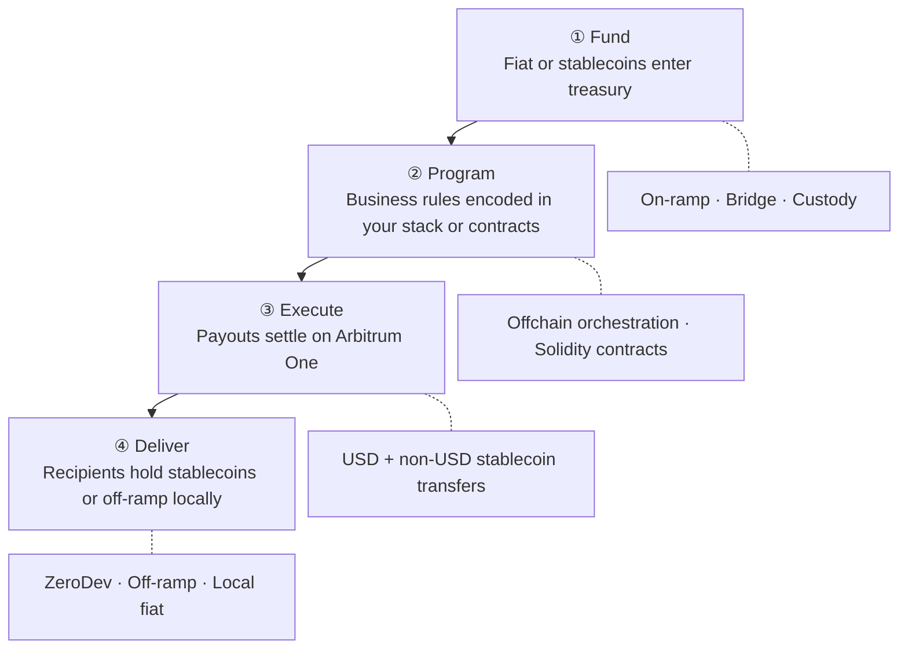
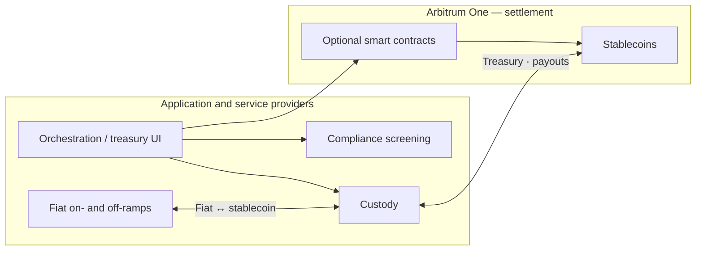
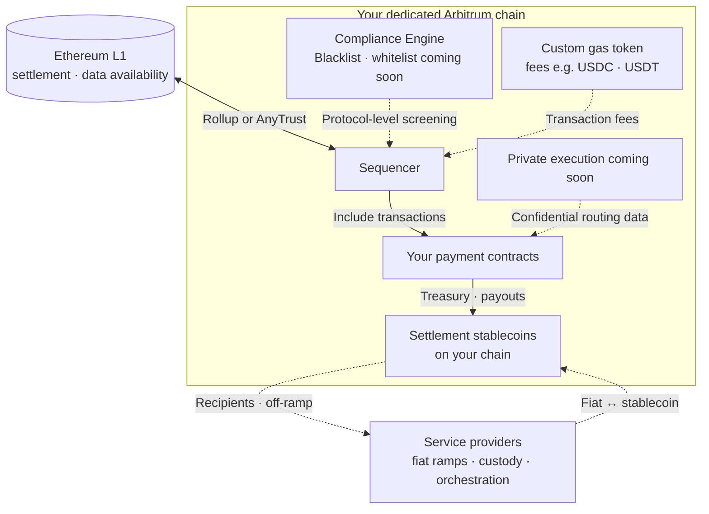

Payments on Arbitrum replace fragmented settlement rails with a single programmable flow. For cross-border treasury and payouts, that means skipping multi-hop correspondent banking — fund in fiat or stablecoins, define your payout logic, and reconcile with a clear onchain audit trail. Arbitrum One offers deep dollar stablecoin liquidity (USDC, USDT, PYUSD) and non-USD-denominated options with meaningful onchain volume (for example EURe, MXNB, MYRC), as well as sub-cent transaction costs and 24/7 settlement, reducing the need to pre-fund nostro accounts across weekends and holidays.

:::info[Start on Arbitrum One]
For most payment pilots, we recommend starting on Arbitrum One before building a [dedicated Arbitrum chain](#launch-a-dedicated-arbitrum-chain). You get immediate access to billions in stablecoin liquidity with reduced infrastructure overhead.
:::

## How payments work on Arbitrum {#how-payments-work-on-arbitrum}

The repeatable pattern, used at scale by platforms like [Rise](https://blog.arbitrum.io/rise-global-payments/), has four stages. Your team can implement each stage with existing service providers, custom smart contracts, or a combination of both.

<table className="solutions-payments-table">
  <thead>
    <tr>
      <th>Stage</th>
      <th>What happens</th>
      <th>Where to learn more</th>
    </tr>
  </thead>
  <tbody>
    <tr>
      <td><strong>Fund</strong></td>
      <td>Treasury receives fiat or stablecoins; optional on-ramp or bridge</td>
      <td><a href="/arbitrum-bridge/usdc-arbitrum-one">USDC on Arbitrum One</a>, <a href="/build-decentralized-apps/bridging/overview">Bridging overview</a>, <a href="#fiat-on-and-off-ramps">Fiat on- and off-ramps</a></td>
    </tr>
    <tr>
      <td><strong>Program</strong></td>
      <td>Business rules (who, how much, when, limits) encoded in your stack or smart contracts</td>
      <td><a href="/build-decentralized-apps/quickstart-solidity-remix">Build apps with Solidity quickstart</a></td>
    </tr>
    <tr>
      <td><strong>Execute</strong></td>
      <td>Payouts settle on Arbitrum One in seconds; soft confirmation in sub-second, hard finality in minutes once posted to Ethereum</td>
      <td><a href="/for-devs/third-party-docs/Circle/usdc-quickstart-guide">USDC quick start guide</a>, <a href="/how-arbitrum-works/deep-dives/transaction-lifecycle">Transaction lifecycle</a>, <a href="https://blog.arbitrum.io/l1-vs-l2-choosing-the-right-chain-architecture-for-your-enterprise/#security-finality">Security and finality</a> <em>(external)</em></td>
    </tr>
    <tr>
      <td><strong>Deliver</strong></td>
      <td>Recipients hold stablecoins (for example USDC, EURe, MXNB, or MYRC) or off-ramp to local currency</td>
      <td><a href="#payments-ecosystem">Payments ecosystem</a> below</td>
    </tr>
  </tbody>
</table>

### Reference architecture

A common wiring for **treasury and payment teams** (neobanks to global banks) settling on Arbitrum One. **Fiat stays offchain**; only stablecoins (USDC, USDT, PYUSD, EURe, MXNB, MYRC, etc.) settle at wallet addresses on the chain — via [on-ramp service providers](#payments-ecosystem), custody, or bridge/CCTP.

Bridge or Circle CCTP can fund treasury wallets via custody. Not every box is required — most pilots use **custody + native USDC + one ramp service provider**. See the [four-stage flow](#how-payments-work-on-arbitrum) above.

## Choose your deployment path

Three paths cover most payment builds: settle on Arbitrum One without custom contracts; add payment smart contracts on Arbitrum One; or launch a dedicated Arbitrum chain when you need chain-level economics, compliance, or privacy. Details for each path are below.

### Settle on Arbitrum One (recommended for pilots)

Use Arbitrum One as your settlement rail. Your product submits stablecoin transfers (for example USDC) over standard RPC. No custom smart contracts are required on day one.

**Choose this when:**

- You want the fastest path to production
- Compliance screening lives offchain with vendors such as Chainalysis — see **Compliance and analytics** in the [payments ecosystem](#payments-ecosystem) below
- You need access to existing stablecoin liquidity and off-ramps

:::tip[Wallet UX for pilots — ZeroDev]
If payers or payees touch funds onchain, start with **[ZeroDev](https://docs.zerodev.app/)** smart accounts (built by Offchain). ZeroDev solves the cold-start problem: passkey or social login, sponsored gas (or gas paid in your settlement ERC-20), and batched transfers on Arbitrum One — without building wallet infrastructure from scratch. It works with whichever stablecoin you settle in, not USDC alone. See [ZeroDev on Arbitrum](/for-devs/third-party-docs/ZeroDev/zero-dev).
:::

**Core documentation:**

- [USDC on Arbitrum One](/arbitrum-bridge/usdc-arbitrum-one): native USDC vs bridged USDC (USDC.e)
- [USDC quick start guide](/for-devs/third-party-docs/Circle/usdc-quickstart-guide): validate your first programmatic transfer on Arbitrum Sepolia, then mainnet
- [ZeroDev on Arbitrum](/for-devs/third-party-docs/ZeroDev/zero-dev): embedded smart accounts and gasless UserOps
- [Chain info](/for-devs/dev-tools-and-resources/chain-info): chain IDs and network parameters
- [RPC endpoints and providers](/build-decentralized-apps/reference/node-providers)
- [Gas and fees](/how-arbitrum-works/deep-dives/gas-and-fees)
- [How to estimate gas](/build-decentralized-apps/how-to-estimate-gas)

### Build a payments application on Arbitrum One

Deploy **Solidity smart contracts** for treasury logic, routing, FX policy, or payout automation directly on Arbitrum One. Combine onchain execution with offchain compliance and fiat rails. If you later need chain-level control (custom gas, compliance engine, private execution), you can [launch a dedicated Arbitrum chain](#launch-a-dedicated-arbitrum-chain) and deploy the same style of contracts there.

**Choose this when:**

- Payout rules, limits, or multi-party approvals must be enforced onchain
- You want composability with DeFi liquidity and existing Arbitrum integrations
- You are building a proprietary orchestration layer (similar to [Rise](https://blog.arbitrum.io/rise-global-payments/) programmable payroll)

**Core documentation:**

- [ZeroDev on Arbitrum](/for-devs/third-party-docs/ZeroDev/zero-dev): recommended smart accounts for payers and payees (gasless flows, session keys, batching)
- [ZeroDev documentation](https://docs.zerodev.app/): SDKs, paymaster, and integration guides
- [Build apps with Solidity quickstart](/build-decentralized-apps/quickstart-solidity-remix): deploy your first contract
- [Cross-chain messaging](/build-decentralized-apps/bridging/cross-chain-messaging): coordinate logic across chains
- [Oracles overview](/build-decentralized-apps/oracles/overview-oracles): FX rates and external data
- [Circle Paymaster quickstart](/for-devs/third-party-docs/Circle/usdc-paymaster-quickstart): let users pay gas in USDC
- [LayerZero](/for-devs/third-party-docs/LayerZero): omnichain messaging and tokens
- [Allium on Arbitrum](https://docs.allium.so/historical-data/supported-blockchains/evm/arbitrum): query transfers and balances for reconciliation
- [Arbitrum SDK](https://github.com/OffchainLabs/arbitrum-sdk): bridging and messaging utilities

#### Private payments

Confidential amounts and counterparties can be implemented at the **smart contract** layer on Arbitrum One or at **chain** level on a dedicated Arbitrum chain. On Arbitrum One, explore [Fhenix CoFHE](https://cofhe-docs.fhenix.zone/) (encrypted contract logic on Arbitrum Sepolia today) and [Railgun](https://railgun.org/) (private transfers). Chain-level private execution is on the [dedicated chain](#launch-a-dedicated-arbitrum-chain) roadmap. For architecture scoping, [contact Offchain Enterprise Services](https://www.offchain.io/contact).

:::caution[Sample payment contracts]
Arbitrum docs do not yet include reference contracts for treasury, batch payout, or remittance flows. For v1 pilots, use the [USDC quick start guide](/for-devs/third-party-docs/Circle/usdc-quickstart-guide) to validate settlement, then work with your engineering team or [contact Offchain Enterprise Services](https://www.offchain.io/contact) to design contract architecture.
:::

### Launch a dedicated Arbitrum chain {#launch-a-dedicated-arbitrum-chain}

Deploy your **own Arbitrum chain** when you need control over network economics, fee denomination, permissions, and data visibility. This path fits teams scaling proprietary payment infrastructure (neobanks, payment platforms, and banks). You can deploy **your own payment smart contracts** on the chain (the same programmability as a payments application on Arbitrum One) while adding chain-level controls that Arbitrum One alone cannot offer.

Many pilots settle in existing stablecoins (USDC, USDT, PYUSD, or non-USD-denominated assets such as EURe, MXNB, and MYRC). Teams can also issue a custom settlement token — for **tokenized deposits**, **bank-branded assets**, or a **custom gas token** on your chain. See [Issuing your own stablecoin](#issuing-your-own-stablecoin) or [contact Offchain Enterprise Services](https://www.offchain.io/contact) for issuance design.

**Choose this when:**

- You require stablecoin-denominated network fees (USDC or USDT as gas)
- You need **deeper** protocol-level compliance controls or restricted participation (beyond application-layer screening on Arbitrum One; see Compliance Engine below for dedicated chains)
- Proprietary routing, FX, or counterparty data must not appear on a public ledger

**Ethereum L1** anchors security and finality; **your chain** settles stablecoins and payment contracts; **service providers offchain** handle fiat (same pattern as the [reference architecture](#reference-architecture)). **Compliance Engine** (coming soon, **dedicated Arbitrum chains only**) screens transactions at inclusion — blacklist is rolling out; whitelist (coming soon) — deeper and more customizable than application-layer tools (for example Chainalysis on Arbitrum One). A dedicated chain adds chain-level control — it does not replace [third-party service providers](#payments-ecosystem).

**Core documentation:**

- [Overview of Arbitrum chains](/launch-arbitrum-chain/a-gentle-introduction)
- [Deploy a production chain: overview](/launch-arbitrum-chain/arbitrum-chain-sdk-introduction)
- [Why choose a custom gas token](/launch-arbitrum-chain/features/common/gas-and-fees/choose-custom-gas-token)
- [Configure a custom gas token (AnyTrust)](/launch-arbitrum-chain/configure-your-chain/common/gas/use-a-custom-gas-token-anytrust)
- [Configure a custom gas token (Rollup)](/launch-arbitrum-chain/configure-your-chain/common/gas/use-a-custom-gas-token-rollup)
- [Native mint/burn gas token](/launch-arbitrum-chain/configure-your-chain/common/gas/configure-native-mint-burn-gas-token)
- [Implement Circle bridged USDC](/launch-arbitrum-chain/third-party-integrations/bridged-usdc-standard)
- [Ownership structure and access control](/launch-arbitrum-chain/maintain-your-chain/ownership-structure-access-control)
- [Third-party infrastructure providers](/launch-arbitrum-chain/third-party-integrations/third-party-providers)

**Features coming soon to dedicated Arbitrum chains:**

<table className="solutions-payments-table solutions-payments-table-compact">
  <thead>
    <tr>
      <th>Capability</th>
      <th>Status</th>
      <th>Description</th>
    </tr>
  </thead>
  <tbody>
    <tr>
      <td><strong>Compliance Engine</strong></td>
      <td>Blacklist rolling out; whitelist (coming soon)</td>
      <td>Dedicated Arbitrum chains only. Bring-your-own-provider KYC/AML screening with deeper, protocol-level transaction filtering than app-layer compliance tools on Arbitrum One</td>
    </tr>
    <tr>
      <td><strong>Private Chains</strong></td>
      <td>(coming soon)</td>
      <td>Confidential execution for proprietary routing, FX margins, and counterparty data</td>
    </tr>
  </tbody>
</table>

Until these advanced features ship, [contact Offchain Enterprise Services](https://www.offchain.io/contact) to learn more about early access.

## Choose stablecoins by corridor

Map settlement assets to **destination market**, **liquidity**, and **issuer** requirements. Verify token addresses on [Arbiscan](https://arbiscan.io/) before production.

### USD-denominated (Arbitrum One)

<table className="solutions-payments-table">
  <thead>
    <tr>
      <th>Stablecoin</th>
      <th>Issuer</th>
      <th>Description</th>
      <th>Documentation</th>
    </tr>
  </thead>
  <tbody>
    <tr>
      <td><strong>Native USDC</strong></td>
      <td>Circle</td>
      <td>Default for most dollar pilots; native issuance on Arbitrum One with CEX support and direct redemption</td>
      <td><a href="/arbitrum-bridge/usdc-arbitrum-one">USDC on Arbitrum One</a> · <a href="/for-devs/third-party-docs/Circle/usdc-quickstart-guide">USDC quick start</a></td>
    </tr>
    <tr>
      <td><strong>Bridged USDC (USDC.e)</strong></td>
      <td>Circle (via Arbitrum bridge)</td>
      <td>Legacy bridged USDC from Ethereum; prefer native USDC for new production flows</td>
      <td><a href="/arbitrum-bridge/usdc-arbitrum-one">USDC on Arbitrum One</a></td>
    </tr>
    <tr>
      <td><strong>USDT</strong></td>
      <td>Tether</td>
      <td>Widely used in LATAM, Africa, and parts of APAC</td>
      <td><a href="https://tether.to/en/developers">Tether documentation</a> <em>(external)</em></td>
    </tr>
    <tr>
      <td><strong>PYUSD</strong></td>
      <td>Paxos</td>
      <td>PayPal USD on Arbitrum One; suited to PayPal ecosystem payouts</td>
      <td><a href="https://docs.paxos.com/guides/developer/blockchains">Paxos blockchains</a> <em>(external)</em></td>
    </tr>
    <tr>
      <td><strong>USDL</strong></td>
      <td>Paxos International</td>
      <td>Yield-bearing USD stablecoin on Arbitrum One for treasury yield use cases</td>
      <td><a href="https://www.paxos.com/newsroom/yield-bearing-stablecoin-lift-dollar-usdl-launches-on-arbitrum">USDL on Arbitrum</a> <em>(external)</em></td>
    </tr>
  </tbody>
</table>

More USD-denominated tokens are listed on the [Arbitrum Portal](https://portal.arbitrum.io/).

### Non-USD-denominated (Arbitrum One)

Non-USD stablecoins with meaningful volume on Arbitrum today for corridor-specific pilots. Verify contract addresses on [Arbiscan](https://arbiscan.io/) before production.

<table className="solutions-payments-table">
  <thead>
    <tr>
      <th>Stablecoin</th>
      <th>Issuer</th>
      <th>Description</th>
      <th>Documentation</th>
    </tr>
  </thead>
  <tbody>
    <tr>
      <td><strong>EURe</strong></td>
      <td>Monerium</td>
      <td>Euro e-money token, 1:1 with EUR; available on Arbitrum for SEPA-corridor and euro-native settlement</td>
      <td><a href="https://monerium.com/eure/">EURe</a> <em>(external)</em></td>
    </tr>
    <tr>
      <td><strong>MXNB</strong></td>
      <td>Juno</td>
      <td>Mexican peso stablecoin, 1:1 with MXN; fiat-backed for LATAM corridor access on Arbitrum</td>
      <td><a href="https://mxnb.mx/en-US">MXNB</a> <em>(external)</em></td>
    </tr>
    <tr>
      <td><strong>MYRC</strong></td>
      <td>BLOX</td>
      <td>Malaysian ringgit stablecoin, 1:1 with MYR; issued on Arbitrum for APAC fiat and crypto rails</td>
      <td><a href="https://www.blox.my/">BLOX / MYRC</a> <em>(external)</em></td>
    </tr>
  </tbody>
</table>

More non-USD-denominated tokens are listed on the [Arbitrum Portal](https://portal.arbitrum.io/).

### Issuing your own stablecoin {#issuing-your-own-stablecoin}

Deploy a custom ERC-20 on Arbitrum One with the [Create a token quickstart](/build-decentralized-apps/quickstart-create-a-token). For bank-branded or corridor-specific settlement assets, work with issuance providers in the [payments ecosystem](#payments-ecosystem) below (for example Circle [bridged USDC](/launch-arbitrum-chain/third-party-integrations/bridged-usdc-standard) on dedicated chains, or fiat-backed issuers such as Monerium, Paxos, and BLOX). [Contact Offchain Enterprise Services](https://www.offchain.io/contact) for issuance architecture.

## Payments ecosystem {#payments-ecosystem}

The following service providers are commonly used in production payment stacks on Arbitrum. Links point to Arbitrum docs where available; external links go to provider documentation. Listing a provider does not imply an official commercial partnership with Offchain.

### Fiat on- and off-ramps {#fiat-on-and-off-ramps}

| Provider | Description | Documentation |
| --- | --- | --- |
| Yellow Card | Africa-focused fiat ↔ crypto | [Yellow Card](https://yellowcard.io/) *(external)* |
| MoonPay | Global fiat on-ramp | [MoonPay documentation](https://dev.moonpay.com/) *(external)* |
| Banxa | Fiat gateway | [Banxa documentation](https://docs.banxa.com/) *(external)* |
| Transak | Fiat on- and off-ramp API | [Transak documentation](https://docs.transak.com/) *(external)* |

### Custody

| Provider | Description | Documentation |
| --- | --- | --- |
| Fireblocks | Wallet and treasury infrastructure for institutional teams | [Fireblocks documentation](https://developers.fireblocks.com/) *(external)* |
| BitGo | Qualified custody and wallet API | [BitGo documentation](https://developers.bitgo.com/) *(external)* |
| Coinbase Institutional | Custody and trading (Coinbase product) | [Coinbase Institutional](https://www.coinbase.com/institutional) *(external)* |

### Compliance and analytics

| Provider | Description | Documentation |
| --- | --- | --- |
| TRM Labs | Blockchain intelligence and AML | [TRM Labs](https://www.trmlabs.com/) *(external)* |
| Chainalysis | Compliance and investigation tools | [Chainalysis](https://www.chainalysis.com/) *(external)* |
| Elliptic | Crypto compliance and screening | [Elliptic](https://www.elliptic.co/) *(external)* |

### Oracles and market data

| Provider | Description | Documentation |
| --- | --- | --- |
| Chainlink | Price feeds and automation | [Chainlink on Arbitrum](/for-devs/oracles/chainlink/) |
| Pyth Network | Real-time financial market data | [Pyth documentation](https://docs.pyth.network/) *(external)* |

### Wallets and smart accounts (recommended)

<table className="solutions-payments-table">
  <thead>
    <tr>
      <th>Provider</th>
      <th>Description</th>
      <th>Documentation</th>
    </tr>
  </thead>
  <tbody>
    <tr>
      <td><strong>ZeroDev</strong></td>
      <td>Offchain smart account stack: gasless or ERC-20 gas, passkey/social login, batching, session keys for payouts on Arbitrum</td>
      <td><a href="/for-devs/third-party-docs/ZeroDev/zero-dev">ZeroDev on Arbitrum</a> · <a href="https://docs.zerodev.app/">ZeroDev docs</a></td>
    </tr>
  </tbody>
</table>

### Payment orchestration

| Provider | Description | Documentation |
| --- | --- | --- |
| Stripe (Bridge) | Fiat and stablecoin payment infrastructure | [Bridge documentation](https://apidocs.bridge.xyz/) *(external)* |
| LayerZero | Omnichain messaging and tokens | [LayerZero on Arbitrum](/for-devs/third-party-docs/LayerZero) |

### Data and reconciliation

| Provider | Description | Documentation |
| --- | --- | --- |
| Allium | Arbitrum transfers, balances, and SQL/API analytics for treasury reconciliation | [Allium on Arbitrum](https://docs.allium.so/historical-data/supported-blockchains/evm/arbitrum) *(external)* |

Explore more projects on the [Arbitrum Portal](https://portal.arbitrum.io/).

## Recommended pilot checklist

A minimal path from zero to a verified settlement on Arbitrum One. Skip steps that do not apply to your [deployment path](#choose-your-deployment-path).

1. **Pick a deployment path.** Most pilots start by settling on Arbitrum One without custom contracts. Add onchain treasury contracts if you need them; launch a dedicated chain only if you need chain-level control.

2. **Pick a stablecoin for your corridor.** Dollar pilots: [native USDC on Arbitrum One](/arbitrum-bridge/usdc-arbitrum-one). See [Choose stablecoins by corridor](#choose-stablecoins-by-corridor) for USDT, PYUSD, or non-USD-denominated options (EURe, MXNB, MYRC).

3. **Prove settlement on testnet.** Configure RPC via [Chain info](/for-devs/dev-tools-and-resources/chain-info) (chain ID `421614`), fund Sepolia ETH and USDC ([Circle faucet](https://faucet.circle.com/)), and complete a transfer with the [USDC quick start guide](/for-devs/third-party-docs/Circle/usdc-quickstart-guide). Confirm on [Arbitrum Sepolia Arbiscan](https://sepolia.arbiscan.io/).

4. **Add ZeroDev if end users touch funds onchain.** Integrate [ZeroDev on Arbitrum](/for-devs/third-party-docs/ZeroDev/zero-dev) for passkey login and gasless payouts. Skip this step if only your treasury wallet sends transfers.

5. **Wire production service providers before mainnet volume.** Choose on-ramps, custody, and compliance screening from the [payments ecosystem](#payments-ecosystem). Track payouts with [Allium on Arbitrum](https://docs.allium.so/historical-data/supported-blockchains/evm/arbitrum) when you need reconciliation at scale.

## Get help

- Work with the [Offchain Enterprise Services team](https://www.offchain.io/contact) for solution design, pilot scoping, and payment infrastructure support.
